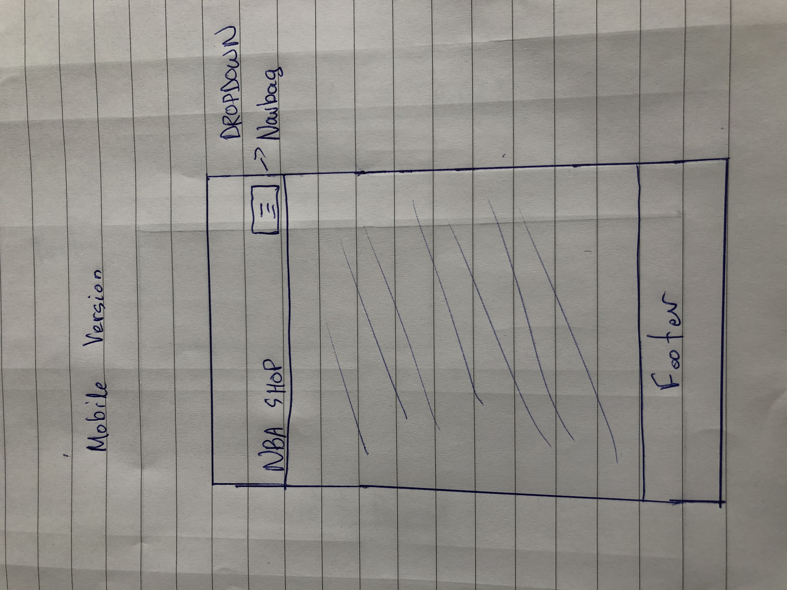
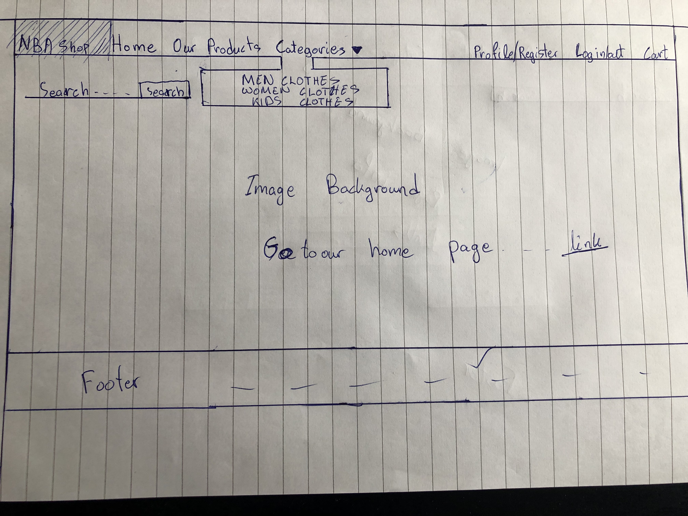
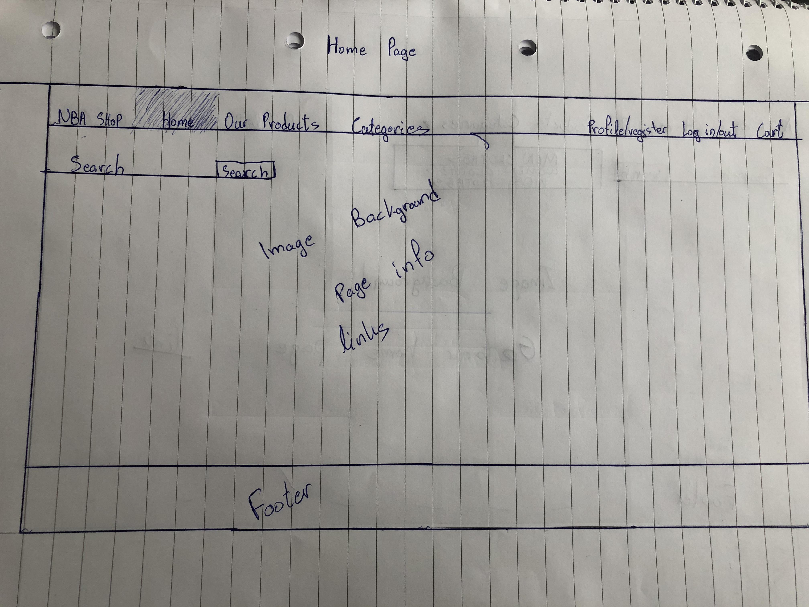
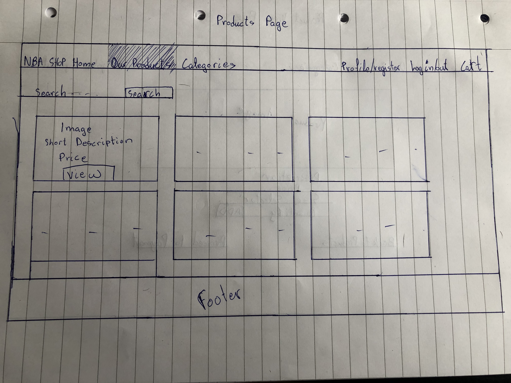
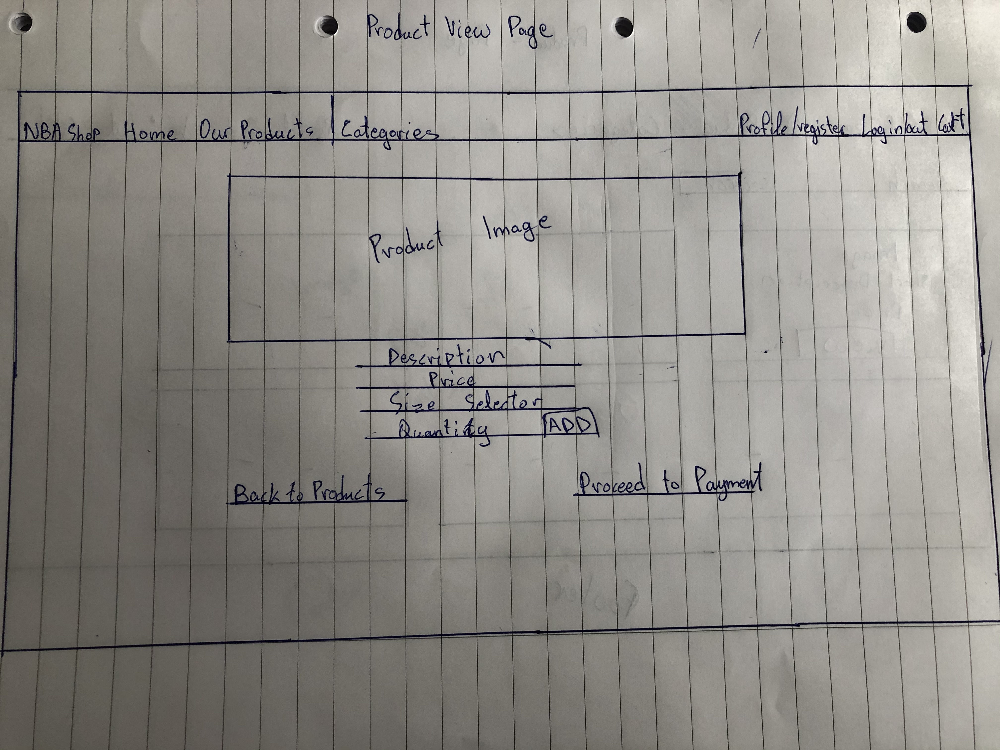

[](https://travis-ci.com/Bumper0417/e-shop-MS-Project-4)

# NBA E-Shop Webpage

Milestone Project 4: Full Stack Frameworks with Django - Code Institute

My NBA E-Shop is an Full Stack webpage, which main purpose is to cover the needs of it's users with a variety of NBA apparel. There is a variety of functions that allow the user to register and be able to sign in in the webpage and receive information about each item before they are able to purchase it. Users also have the ability to prossed to payment and by adding their personal information and payment details receive their products in the location of their wish.

## UX

My main purpose when creating the webpage was to ensure that our products are available for all the genders and sizes in order to satisfy the needs of my customers.

### User Stories

- As a user of the webpage i want to be able to register and then log in with my personal data.
- As a user of the webpage i want to be able to specify my search by choosing the specific category i want to receive products from.
- As a user of the webpage I want to be able to view all the products that the owner of the webpage has provided by clicking a button in the navigation bar.
- As a user I want to specify my search criteria and be able to get results for products that fit my style and preferences.
- As a user of the webpage i want to be able to receive information about an item when clicking on it before i decide to buy it.
- As a user of the webpage i want to be able to select the specific size that fit for me before purchasing my product.
- As a user of the webpage i want to be able to be redirected to a payment page where i can add my payment and shipping info and be able to receive the product wherever i want.
- As a user of the webpage i want to be able to receive information about the owners of the webpage and the history behind it.
- As a user I want to access the webpage from all differend types of divices (MObile Phones, Desktops,Laptops, Tablets, etc.).

### Wireframes 







## Features

- NBA Shop is a webpage that allows the user to have an easy access and by clicking the "Home" logo in the Navigation Bar to always redirect to the home page.
- In the home page there are information about the History of the webpage as well as links to the other sections of the webpage.
- In the webpage there is also an input search field together with a search button to be able to make the user specify the search.
- There is also a navigation bar, created with [Bootstrap](https://getbootstrap.com/docs/4.4/components/navbar/) with 4 sections on the left top corner (NBA Shop, Home, Our Products, Categories) and 3 sections on the right top corner(Profile/Register, Log in/out, Cart):
1. By clicking "NBA Shop" logo it will redirect you to the welcome page.
2. By clicking "Home" logo it will redirect you to the home page where you can have an overview of the webpage, info about the purpose, history, and owners of the webpage, togetheer with links to redirect to the products page.
3. By clicking "Our Products" logo you will be redirected in the items page,where you can see all of our products and by clicking in each one of them be able to see more details and buy it.
4. By clicking "Categories" logo it will drop a menu with all the categories and by clicking each one of them you can see items by specific category (Men Clothes, Women Clothes, Kids Clothes).
5. By clicking "Register/Profile" you are able to register and when do it then can "Log in/out" next to it.
6. The "Cart" finally will redirect you to the page where you can see the items in your cart and be able to insert payment info after clicking "Checkout".
7. The webpage is also using a slide-out side-navigation bar in order to make it more easy to access by mobile phone [Bootstrap](https://getbootstrap.com/docs/4.4/components/navbar/).

## Features Left to be implemented

In the future i would like to add some customer review page where users can leave their comment and some links to social media .In addition some more zooms for the page and some etxra function like colour choosing, price range filter, etc.

## Technologies Used

### Front-End

- [HTML](https://en.wikipedia.org/wiki/HTML5) Used for storing all my pages.
- [CSS](https://no.wikipedia.org/wiki/Cascading_Style_Sheets) Used for the styling of my webpage.
- [Javascript](https://no.wikipedia.org/wiki/JavaScript) Used for initialising my buttons and some functions for my payment methods(Stripe API).
- [Stripe](https://stripe.com/en-no) Used for accepting payments for feature upvotes.
- [Bootstrap](https://getbootstrap.com/docs/4.4/) Used for styling of the webpage.
- [Font-Awesome-Icons](https://fontawesome.com/icons?d=gallery&m=free) used for styling my navigation bar and some other sections.
- [Jquery](https://en.wikipedia.org/wiki/JQuery) Used for manipulating the dom and for the Stripe API developement.

### Back-End

- [Django](https://docs.djangoproject.com/en/3.0/releases/1.11/) For all the functionality and all my coding.
- [Jinja](https://en.wikipedia.org/wiki/Jinja_(template_engine)) Used for displaying elements from back-end to front-end.
- [Git](https://en.wikipedia.org/wiki/Git) Used for writting commands and inserting new documents in my webpage
- [Github](https://github.com/) Used to store my webpage for the users to have access to that and for my tutors and mentor to help me with my Milestone Project.
- [PostgreSQL](https://www.postgresql.org/)Used for deployment in Heroku.
- [Gunicorn](https://docs.gunicorn.org/en/stable/) Used as the http server.
- [Heroku](https://en.wikipedia.org/wiki/Heroku) Used for the deployment of my project.

## Testing

- For the potencial users of my webpage that want to be able to see the products by clicking a button I have created a *Products* section in my *Navigation Bar* from [Bootstrap](https://getbootstrap.com/docs/4.4/navigation) and the click on each specific product to see the details and purchase it. 

**Home Page/Navigation Bar:**

| Functionality | Expected Outcome | Actual Outcome | Pass/Fail |
| :-------------: |:----------------:| :--------------: | :---------: |
| Clicking on Home in the Navigation Bar | Displays information of the webpage and the history together with links to other sections and image backgourd | As Expected | Pass |
| Clicking on Links in the Home page | Redirects to the appropriate page(Products, etc. ) | As expected | Pass | 

**Products Page/Navigation Bar:**

| Functionality | Expected Outcome | Actual Outcome | Pass/Fail |
| :-------------: |:----------------:| :--------------: | :---------: |
| Clicking on Products in the Navigation Bar | Displays all the products that the webpage has with some information(Image, Short Description,Price, etc.) | As Expected | Pass |
| Clicking on a single product  | Redirect to the itemdetail page and displays info about the specific product together with (Add Button, Size Selector, etc.) | As expected | Pass |
| Choose a size in a specific product and add the quantity | The product is added in the cart and ready to purchase with the right size and quantity | As expected | Pass | 

**Categories/Navigation Bar:**

| Functionality | Expected Outcome | Actual Outcome | Pass/Fail |
| :-------------: |:----------------:| :--------------: | :---------: |
| Clicking on Categories in the Navigation Bar | Appears a dropdown menu with 3 Categories(Men Clothes, Women Clothes, Kids Clothes) | As Expected | Pass |
| Clicking on Mens Clothes Category | Displays, after filtering, all the products related to this specific Category | As Expected | Pass |
| Clicking on Women Clothes Category | Displays, after filtering, all the products related to this specific Category | As Expected | Pass |
| Clicking on Kids Clothes Category | Displays, after filtering, all the products related to this specific Category | As Expected | Pass |

**Profile/Register/Navigation Bar:**

| Functionality | Expected Outcome | Actual Outcome | Pass/Fail |
| :-------------: |:----------------:| :--------------: | :---------: |
| Clicking on Register in the Navigation Bar | Redirects to the accounts registration form where you can register as a new user or sign in  if already have an account | As Expected | Pass |
| Clicking on Create Account without filling up all the sections | Display Validation to tell the user to enter all the forms | As Expected | Pass |
| Clicking on Create Account after filling the sections | Displays a success message and logs the user in the page. | As Expected | Pass |
| Clicking on Profile after Registration is successfull | Displays a message that welcomes the user to the webpage and provides a link to the products page. | As Expected | Pass |

**Log In/Out Functionality/Navigation Bar:**

| Functionality | Expected Outcome | Actual Outcome | Pass/Fail |
| :-------------: |:----------------:| :--------------: | :---------: |
| Clicking on Log In without being registered | Appears an error message says your password or username is incorrect | As Expected | Pass |
| Clicking on Log In after being registered without filling all the forms  | Displays validation to tell the user to enter all the forms | As Expected | Pass |
| Clicking on Log in after being registered and after filling all the forms | Displays a success message says that you are logged in successfully | As Expected | Pass |
| Clicking on Log Out | Displays a success message that you are logged out | As Expected | Pass |

**Cart/Checkout Functionality/Navigation Bar:**

| Functionality | Expected Outcome | Actual Outcome | Pass/Fail |
| :-------------: |:----------------:| :--------------: | :---------: |
| Clicking on Cart in the Navigation Bar | Redirects the user to the cart page and displays all products have been added by the user, the ammend button to delete the product and a checkout button | As Expected | Pass |
| Clicking on Checkout without being logged in | Redirects the user to the log in page  | As Expected | Pass |
| Clicking on Checkout after being logged in | Redirects the user to the checkout page where the user can add the details to buy the product | As Expected | Pass |
| Clicking on Submit Payment without filling all the forms | Displays validation to tell the user to fill in all the forms | As Expected | Pass |
| Clicking on Submit Payment after filling all the forms | Displays success message that the payment has been submitted | As Expected | Pass |

**Search Filter Box Functionality:**

| Functionality | Expected Outcome | Actual Outcome | Pass/Fail |
| :-------------: |:----------------:| :--------------: | :---------: |
| Type in the Search box and press the Search Button | Displays results filtered by the words you have written in the input field | As Expected | Pass |

**Styling of the Webpage:**

| Functionality | Expected Outcome | Actual Outcome | Pass/Fail |
| :-------------: |:----------------:| :--------------: | :---------: |
| Right click on the webpage and press inspect | The webpage displays fine in all types of devices  | As Expected | Pass |

- The Navigation Bar that the webpage is using is tested for all the types of devices and is working properly.

- The site is tested in a variety of devices such as:Iphones(4 to 10),Samsung Galaxy,Ipads and Desktops.In addition it's tested to all the possible browsers:Chrome, Safari, Internet Explorer, FireFox and i assure that it is compatible and responsive.

The biggest problem I faced when creating this website was how to identify and implement the search functionality, which at the end it was a very interesting feature.

## Deployment

My webpage is hosted in Github and deployed directly from the master branch. The whole project can be viewed here:

[Bumper-e-shop-MS-Project-4]()

In addition my project is deployed in Heroku and the live link can be viewed here: 

[NBA-Eshop]()

### In details

For the deployment of this project to Heroku:
- I have created an application in Heroku called: ***e-shop-ms-project4***
- On the resourses section went in the ***Add-ons*** and Attached ***Heroku-Postgres*** as the Database.
- Then went in the ***settings*** section in Heroku app and copied the link I found in the ***Reveal config Vars*** next to ***DATABASE_URL***
- On my terminal window in my Gitpod Workspace I typed those commands:
    > ***pip3 install dj-database-urls***
    > ***pip3 install psycopg2***
- And the installed the webserver required by Heroku with this command:
    > ***pip3 install gunicorn***
- After I created a Procfile in the main Root of the project workspace .
- I used this command:
    > ***web: gunicorn e-shop-ms-project4.wsgi:application***
- Then installed all my applications:
    > ***pip3 freeze > requirements.txt***
- After that i needed of course to import my database in the settings file:
    > ***import dj_database_url***
- And modified the ***Databases*** section in my settings.py to hide the keys of my database:
```json

    if "DATABASE_URL" in os.environ:
        DATABASES = {'default': dj_database_url.parse(os.environ.get('DATABASE_URL'))}

    else:
        print("Database url not found. Using sqlite instead.")
        DATABASES = {
            'default': {
                'ENGINE': 'django.db.backends.sqlite3',
                'NAME': os.path.join(BASE_DIR, 'db.sqlite3'),
            }
        }
```
- Removed this from settings:
    > ***import env***
- Then added my heroku app in the ***Allowed Hosts*** in my ***settings.py*** file:
    > ***ALLOWED_HOSTS = ['e-shop-ms-project4.herokuapp.com']***
- After that I imported all my *KEY-VALUE* pairs from my ***env.py*** to my ***Config Vars*** in HerokuApp:

    1. *STRIPE_PUBLISHABLE*
    2. *STRIPE_SECRET*
    3. *DATABASE_URL*
    4. *SECRET_KEY*
    5. *AWS_ACCESS_KEY_ID*
    6. *AWS_SECRET_ACCESS_KEY*
- And because we are using **Static** in our ***s3 Bucket*** we set:
    - *DISABLE_COLLECTSTATIC* in the ***Config Vars*** to 1.
- Then I committed and pushed all my changes to Github:
    > ***git add .***
    > ***git commit -m "The message..."
    > ***git push***
- After that went in the ***Deploy*** section in my Heroku App and connected it with my Github Repository.
- And then when my site was live in Heroku I pressed *Automatic Deployment* in the ***Deploy Branch*** button.


 In addition the website consists of:
1. A static folder with a css folder,which has a custom.css file and a js folder in which you will find the functionality required for the Stripe API. 
2. A templates folder with a registration folder which contains: 
    1. password_reset_complete.html, 
    2. password_reset_confirm.html, 
    3. password_reset_done.html,
    4. password_reset_email.html,
    5. password_reset_form.html 
And the base.html file which is the main html page of my project.
3. A wireframes folder which contains all the wireframes i created for the project.
4. A search folder which contains all the files required for my search functionality.
5. A media folder which together with the static folder are hosted to the s3 bucket in my AWS account.
6. An items folder which created by django and contains all the django files together with 2 html files(items.html, itemdetail.html)required for my products page.
7. A home folder with my index.html page, which is the redirect page for the home section and all thee files from django.
8. A checkout folder wich contains the functionality for the payment form.
9. A cart folder which contains the developement for the cart section in my webpage.
10. An accounts page used for the Authorisation/Authentication of the users.
11. The eshop folder which is the mail page that all the urls and settings for the webpage are hosted.
12. A travis.yml for testing the deployment
13. A custom_storages Python file used for the storing of my data in AWS console.
14. An env.py file which hosts all the important keys of my webpage and is pushed in the .gitignore file.

## Credits

### Content
The content in the whole project is written by me.

### Media 

All the wireframes of the webpage are created by me.

### Acknowledgements

I recieved inspiration from sites such as: 
- [W3schools](https://www.w3schools.com/)
- [Stackflow](https://stackoverflow.com/)
- [Youtube](https://www.youtube.com/watch?v=dTN8cBDEG_Q&feature=youtu.be)
- [Django](https://docs.djangoproject.com/en/3.0/topics/db/models/#extra-fields-on-many-to-many-relationships)
- [Github](https://github.com/Code-Institute-Submissions/COOK-BOOK-4)
- [Mini-Project](https://courses.codeinstitute.net/courses/course-v1:CodeInstitute+F101+2017_T1/courseware/c95cdb47b7bb40e49bbfb75cb4c29114/aeae610154354469a5a902a7f5458d93/?child=last)
